# My personal dotfiles for bspwm, i3-gaps and kde plasma

## BSPWM
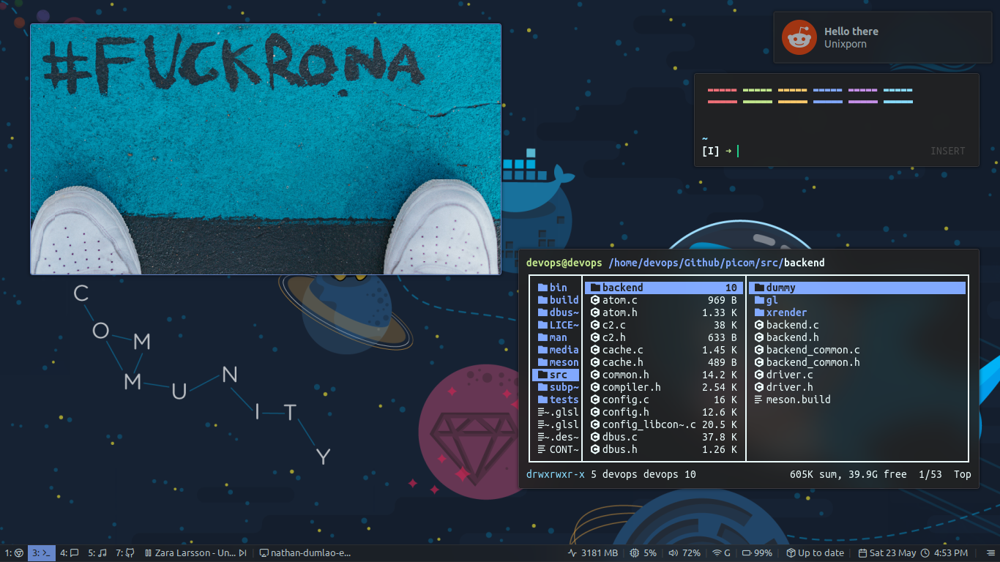

### Tools used 
- Status bar - [Polybar](https://github.com/polybar/polybar)
- Compositor - [Picom](https://github.com/ibhagwan/picom)
- Lock screen - [i3lock-color](https://github.com/Raymo111/i3lock-color) and [mantablockscreen](https://github.com/reorr/mantablockscreen)
- Battery popup - [i3-battery-popup](https://github.com/rjekker/i3-battery-popup/blob/master/i3-battery-popup)
- Notification - [Dunst](https://github.com/dunst-project/dunst)
- USB automount - [udiskie](https://github.com/coldfix/udiskie)
- Application launcher - [Rofi](https://github.com/davatorium/rofi)

Thanks to [Aditya Shakya](https://github.com/adi1090x) for his great looking rofi theme. 
- Rofi theme https://github.com/adi1090x/rofi
## i3-gaps
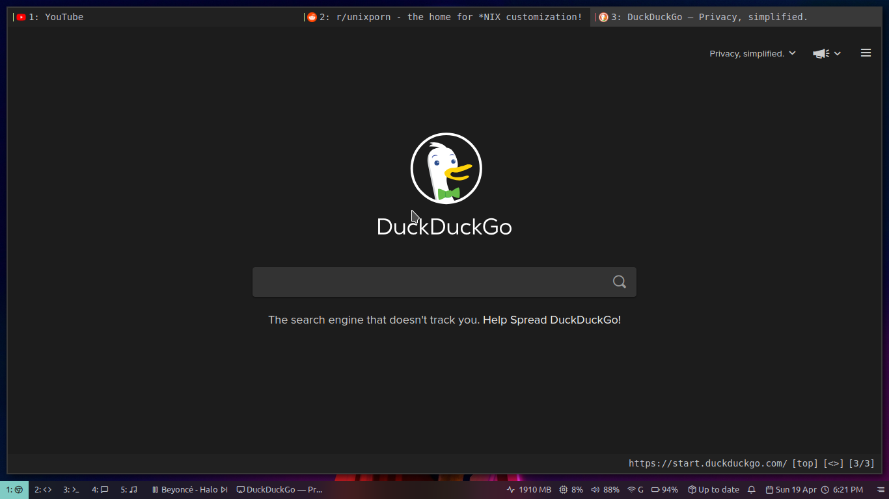
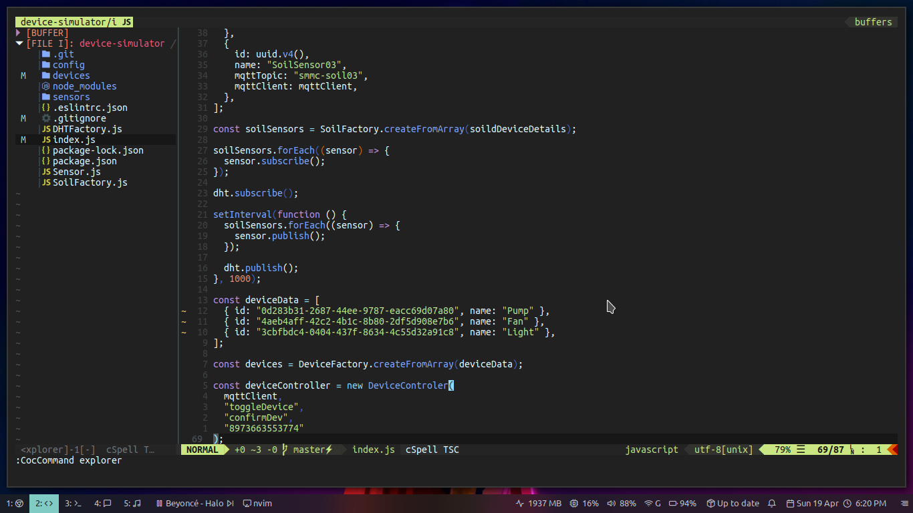
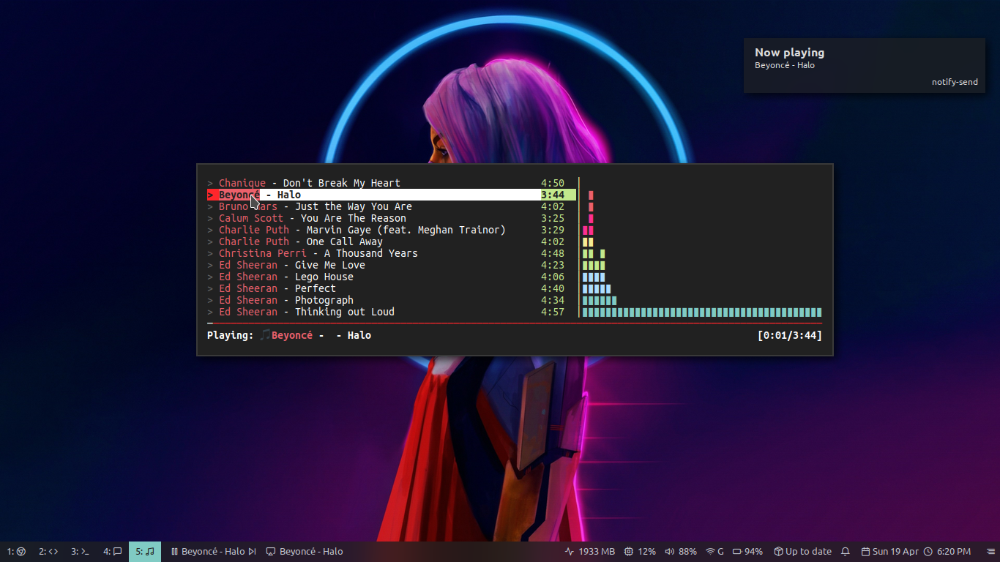
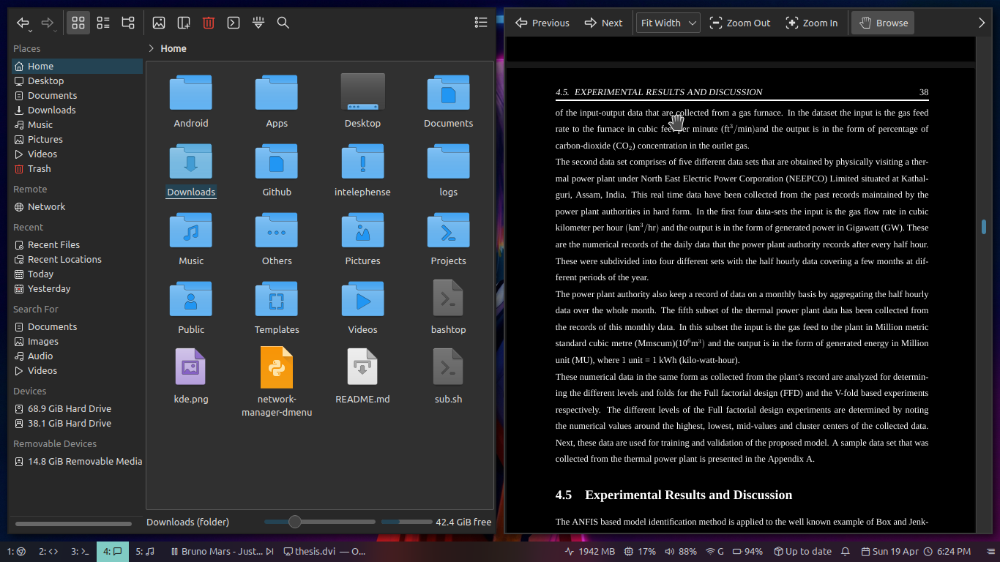
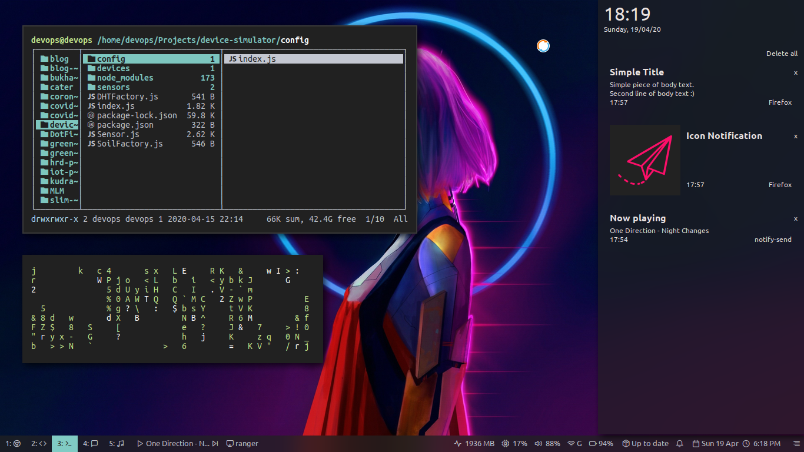
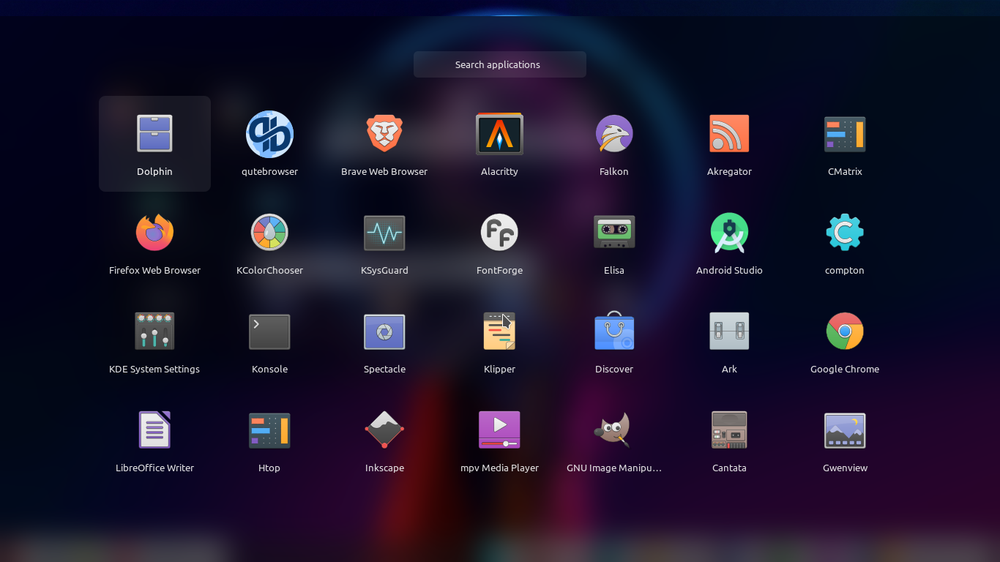

## KDE

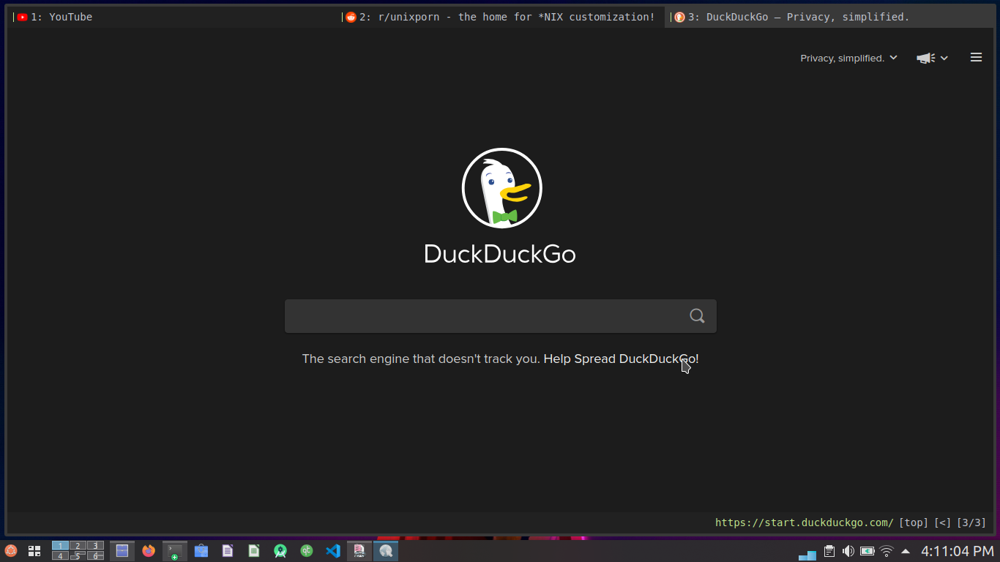
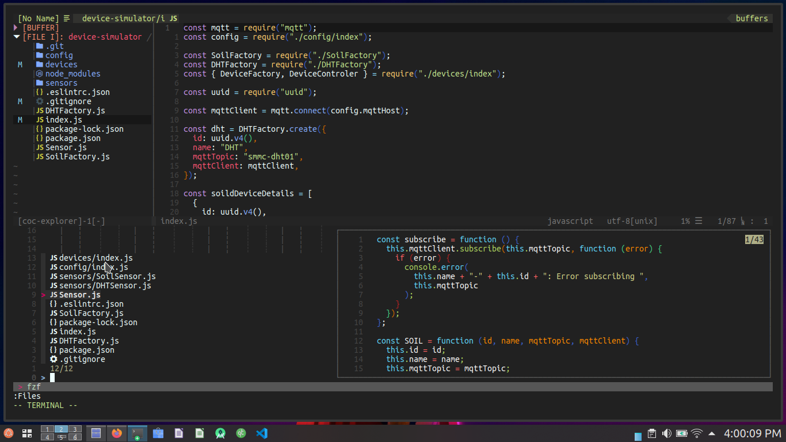
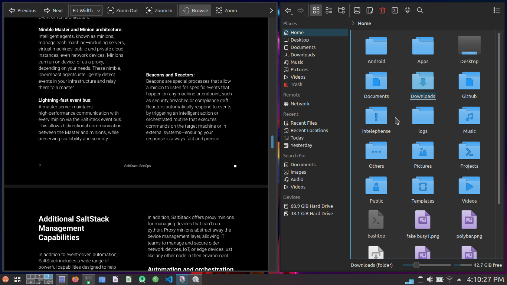
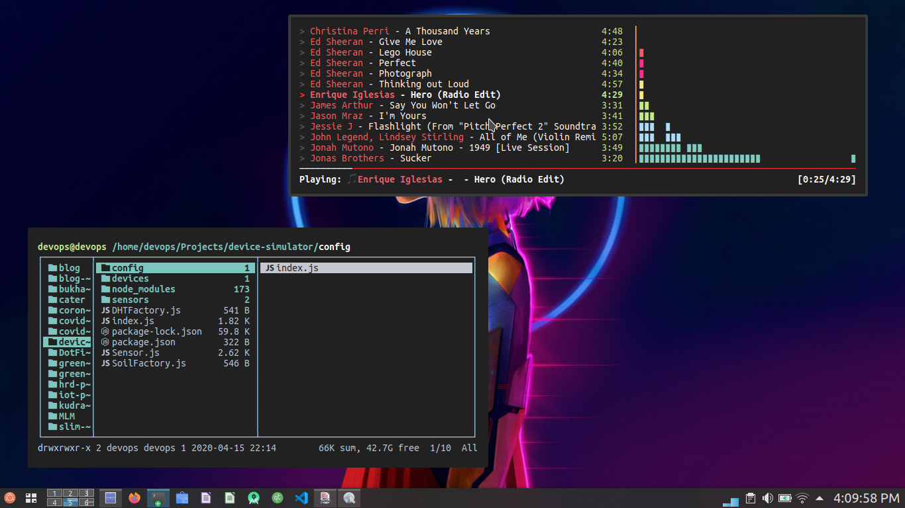
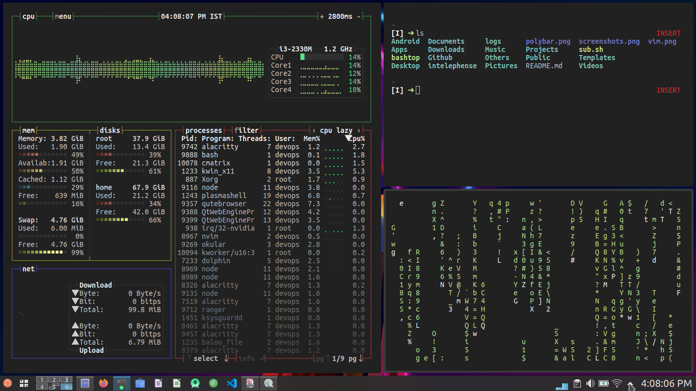
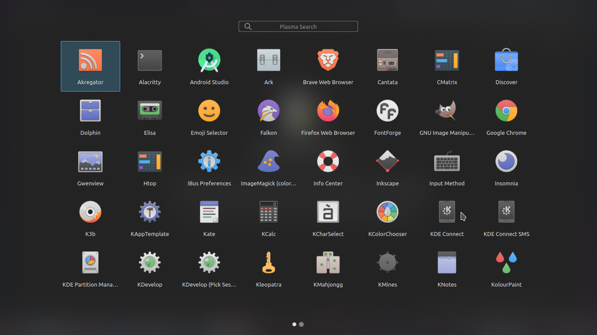

- Plasma color scheme - Customized materia
- Icon theme - [Newaita](https://github.com/cbrnix/Newaita)
- App launcher - [Launchpad](https://store.kde.org/p/1364064/)
- Tiling script - [Krohnkite](https://github.com/esjeon/krohnkite)
