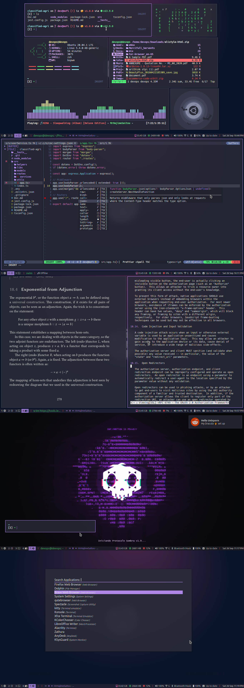
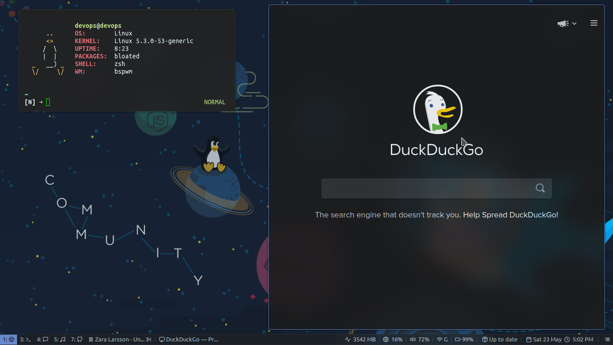

# My personal dotfiles for bspwm, i3-gaps and kde plasma

## Dracula theme

## Material Dark theme

### Tools used 
- Status bar - [Polybar](https://github.com/polybar/polybar)
- Compositor - [Picom](https://github.com/ibhagwan/picom)
- Lock screen - [i3lock-color](https://github.com/Raymo111/i3lock-color) and [mantablockscreen](https://github.com/reorr/mantablockscreen)
- Battery popup - [i3-battery-popup](https://github.com/rjekker/i3-battery-popup/blob/master/i3-battery-popup)
- Notification - [Dunst](https://github.com/dunst-project/dunst)
- USB automount - [udiskie](https://github.com/coldfix/udiskie)
- Application launcher - [Rofi](https://github.com/davatorium/rofi)
- Gui Font - Ubuntu
- Terminal Font - [UbuntuMono Nerd Font](https://github.com/ryanoasis/nerd-fonts/releases/download/v2.1.0/UbuntuMono.zip) and [Hack Nerd Font](https://github.com/ryanoasis/nerd-fonts/releases/download/v2.1.0/Hack.zip)
- Polybar icon font - [feather](https://dropways.github.io/feathericons/) and [FontAwesome](https://fontawesome.com/)

## Applications
- Editor: Neovim
- Music player: ncmpcpp
- File Manager: ranger with devicon
- Web browser: qutebrowser
- System Monitor: htop
- Image viewer: feh
- System details: modified ufetch 
